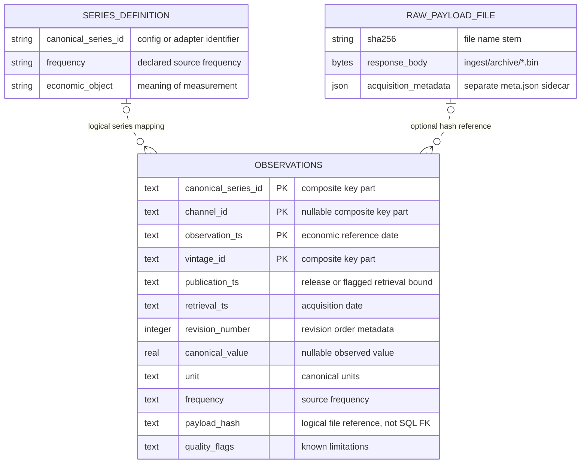

# Local warehouse model and SQL audit guide

The warehouse is a local SQLite research store, not a deployed cloud service.
Its useful warehouse properties are explicit observation grain, retained vintages,
raw-to-canonical lineage and a separate as-of read layer. Adding infrastructure
would not fill the missing economic data, so there is no Snowflake deployment or
unused star schema.

## Grain and physical schema

There is exactly one persistent SQL table: `observations`. Its DDL remains in
`warehouse/pit.py::SCHEMA`; the executable reporting queries are in `warehouse/sql/`.
One row represents one vintage of one canonical series, one optional channel, and
one economic reference date. Values must be interpreted together with their unit,
frequency, economic object and license.

The declared composite primary key is:

```text
(canonical_series_id, channel_id, observation_ts, vintage_id)
```

`channel_id` can be NULL. SQLite's nullable composite-key behavior means this key
does not provide a complete database-level uniqueness guarantee. `PITStore.append`
checks conflicts and repeated fetches; `duplicates.sql` detects duplicates inserted
by bypassing that API. Concurrent writers and stronger null-safe constraints remain
future work. The store is intended for a single local writer, not concurrent ingestion.

## ER diagram: physical table and external logical entities

The diagram deliberately labels external entities. `RAW_PAYLOAD_FILE` is a file,
not a SQL table; `SERIES_DEFINITION` is configuration/adapter metadata, not a
dimension table. Neither relationship is an enforced SQL foreign key. Missing
hashes and missing external definitions are possible.



Only a subset of columns appears above; the DDL and `DATA_DICTIONARY.md` are
authoritative for the full schema. Derived inputs such as `net_refined_imports`
do not have to exist as stored rows: they are computed from eligible raw legs.

## Data layers and lineage

| Layer | Actual artifact | Responsibility |
|---|---|---|
| Raw acquisition | SHA-256-named `.bin` files and metadata sidecars | Preserve response bytes and acquisition context; local files are mutable, not WORM storage |
| Canonical vintage facts | SQLite `observations` | Store source values, canonical units, dates, revisions and provenance |
| As-of analytical reads | Shared `as_of.sql`, then PCS code | Select eligible vintages, retain missingness, then derive and aggregate features |
| Audit outputs | JSON emitted by `scripts.audit_warehouse` | Inspect integrity and requested raw-series availability without modifying evidence |

No persistent SQL views or marts are created by the audit tool. There is no
channel-level exposure fact table because the real outcome panel has not been
obtained. A future series/source dimension might help govern many more inputs,
but introducing empty dimension tables now would misrepresent the implementation.

## SQL questions answered

| Query | SQL concepts | Research purpose |
|---|---|---|
| `inventory.sql` | `GROUP BY`, distinct counts, conditional aggregation | Distinguish vintage rows from reference dates and payloads; surface null values |
| `as_of.sql` | CTEs, `CASE`, `ROW_NUMBER`, bound parameters | Choose one eligible vintage per date/channel without exposing later information |
| `revisions.sql` | `LAG`, partitioned window functions | Inspect successive values without comparing different channels |
| `duplicates.sql` | Composite grouping, `HAVING` | Detect logical-key violations, including NULL-channel duplicates |

The as-of query is shared with the research store, not independently reimplemented.
Comtrade and explicitly unknown-publication rows use the later of publication and
retrieval as their availability bound. This prevents a later snapshot being
treated as an earlier release; it does not reconstruct authentic historical vintages.
The existing source/flag classification still requires source-specific review.

The revision report includes all acquired vintages, ordered by publication,
retrieval, revision number and insertion order. Its adjacent delta is descriptive,
not a measured release surprise. Multiple units or source mappings for the same
canonical identifier require investigation rather than pooling.

## Reproduce a read-only audit

From the repository root, after ingestion:

```bash
python -m scripts.audit_warehouse \
  --db warehouse/data/pit_store.db \
  --asof 2026-09-20 \
  --series volume_oi_churn \
  --series refined_copper_trade_m \
  --series refined_copper_trade_x \
  --series cable_wire_output \
  --revisions refined_copper_trade_m \
  --archive ingest/archive
```

Choose the as-of date deliberately. Repeat `--series` for every expected raw input,
including absent ones. The audit is scoped to that list and does not infer the whole
PCS configuration. To audit net imports, request both raw trade legs; this CLI does
not validate that both exist in every reference month, which remains a research
builder check. The inventory and optional revision report are all-vintage reports,
not date-filtered historical availability claims.

The JSON keeps absent requested inputs with zero eligible rows. Eligibility is
reported at the date/channel-row level; it is not calendar completeness or PCS
block coverage. Exit code 0 means the requested integrity checks passed, not that
data coverage is adequate. Duplicates or failed requested archive checks produce
exit code 1. Invalid arguments and unavailable databases fail rather than silently
creating a new database.

Without `--archive`, no raw-byte verification is performed. With it, every distinct
referenced hash is checked, including missing/invalid references. Unreferenced
archive files and metadata sidecars are outside that check. The JSON may contain
licensed research values if revision history is requested; do not publish it
without reviewing the license.

## Why these skills belong here

- **SQL:** Queries make data assumptions inspectable instead of hiding them in charts.
- **Database modeling:** Grain and key definitions expose revision and duplicate risks.
- **Warehouse design:** Separating raw evidence, canonical facts and analytical reads
  helps preserve provenance without adding an unused platform.
- **Security engineering:** Read-only access and integrity checks protect the evidence
  used to support research claims. The threat model is in `SECURITY.md`.

The implementation remains local and deliberately small. Its value is that the
data assumptions and failure cases can be inspected and reproduced.
